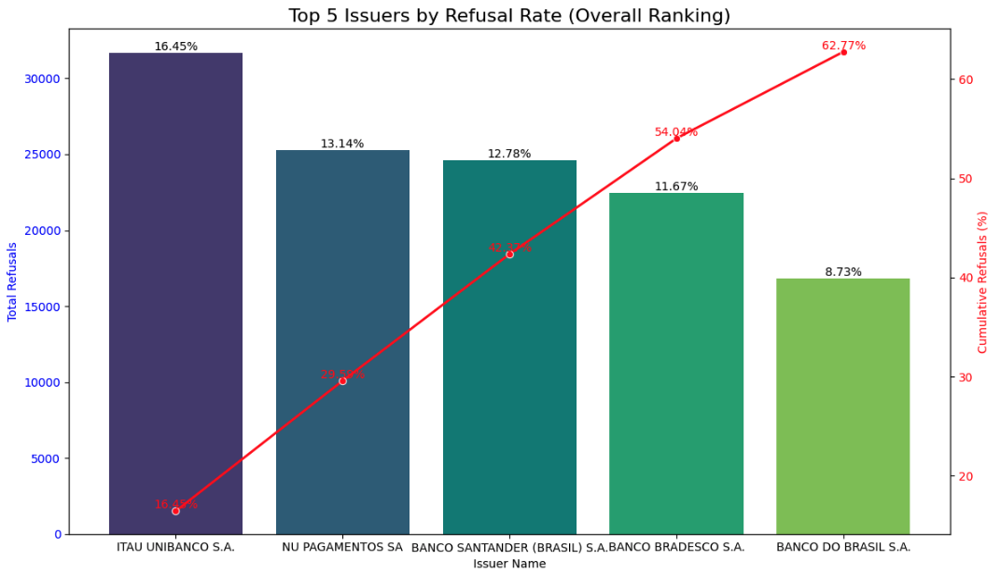
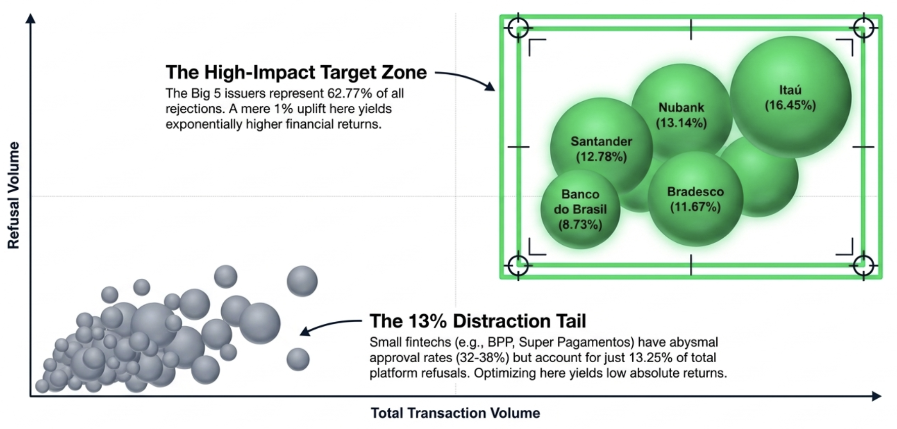
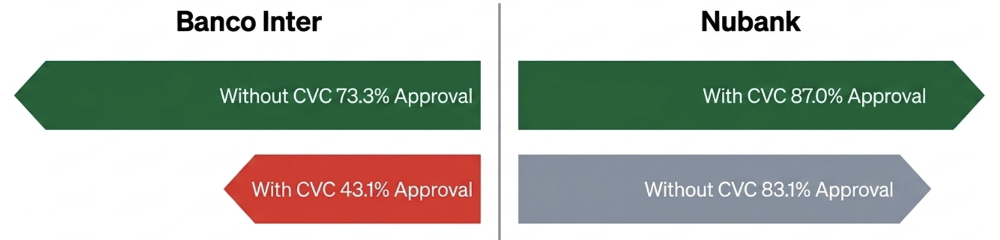
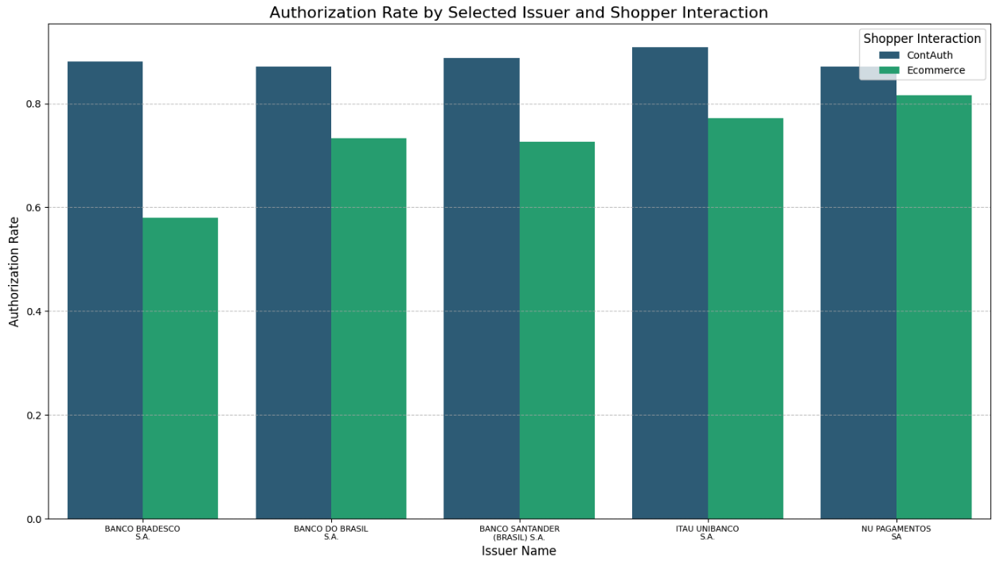
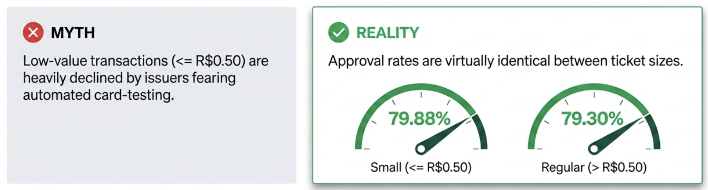
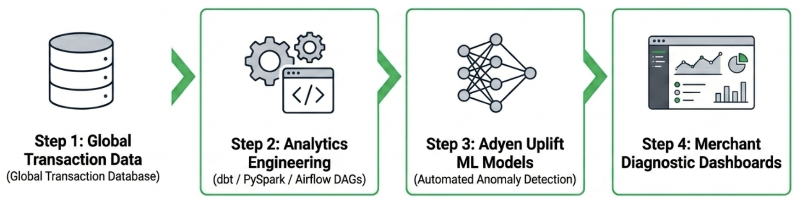

# Adyen Optimisation Data Analyst — Case Study


End-to-end payment optimisation case study analyzing transaction **authorization rates** for an anonymized Adyen merchant, building a hypothesis-testing framework to validate improvement levers, and outlining how the analysis could scale across the full merchant portfolio.

---

## 📌 Business Context

This project was developed as part of Adyen's interview process for the **Optimisation Data Analyst** role. The brief (see [`Case_Study_Statement.pdf`](./Case_Study_Statement_-_Optimisation_Data_Analyst.pdf)) asked for three deliverables, presented to a fictional audience of commercial-team executives:

1. **Insights & recommendations** to improve the merchant's authorization rate — defined as `# authorized transactions / # received transactions`.
2. **A hypothesis-testing design** with a statistically sound framework to validate those recommendations through experimentation.
3. **A scaling strategy** — how the same analytical framework could be industrialized across all merchants, from analysis to technical implementation.

The full slide deck delivered for the interview is available in [`patricia_nascimento_case_study.pptx`](./patricia_nascimento_case_study.pptx).

---

## 🗂️ Data

Anonymized transaction-level data for a single merchant, described in [`adyen_data_dictionary.xlsx`](./adyen_data_dictionary.xlsx):

| Column | Description |
|---|---|
| `psp_reference` | Adyen's internal transaction ID |
| `bin` | Bank Identification Number (first 6 digits of the card) |
| `scheme` | Card network (Visa, Mastercard, etc.) |
| `issuername` | Name of the card-issuing bank |
| `shopper_interaction` | `Ecommerce` (one-off) vs `ContAuth` (recurring/saved card) |
| `avs_data_supplied` | Whether address data was supplied |
| `cvc_data_supplied` | Whether the card's CVC was supplied |
| `currency_code` | Transaction currency |
| `amount` | Transaction amount (local currency) |
| `raw_acquirer_response` | Issuer bank's response code |
| `creation_date` | Transaction timestamp (CET) |
| `received` | Flag for a received transaction |
| `authorization` | `1` = approved, `0` = refused |

---

## 🧠 Approach & Reasoning

The analysis was structured as a numbered notebook pipeline, mirroring how I'd organize a production analytics workflow: separate, reproducible stages instead of one long ad-hoc script — each notebook takes the previous stage's output as its input and hands off a clean artifact to the next.

| # | Notebook | Purpose | What I did & found |
|---|---|---|---|
| 01 | [`01_data_loading.ipynb`](./01_data_loading.ipynb) | **Initial load & data audit** | Loaded the raw CSV (933k+ rows), profiled uniqueness/nulls per column, and confirmed `psp_reference` as the primary key. Diagnosed the two null patterns in the data: (1) missing `issuername` is systematic per-BIN (a mapping/enrichment gap, not random), and (2) transactions with null `bin`/`issuername` are all declined ecommerce payments that fail *before* issuer authorization (likely mistyped cards or automated card-testing) — meaning they sit outside the scope of authorization optimisation. |
| 02 | [`02_data_cleaning.ipynb`](./02_data_cleaning.ipynb) | **Cleaning & type standardisation** | Wrote a single `clean_transactions()` function that: drops constant/redundant columns, casts IDs to string, parses `amount` (comma-separated strings → float), maps `Yes/No` and `1/0` flags to booleans, and parses `creation_date` to datetime. Exported a clean, typed CSV for downstream use. |
| 03 | [`03_exploratory_analysis.ipynb`](./03_exploratory_analysis.ipynb) | **Exploratory analysis** | Computed the baseline authorization rate (**79.3%**) and broke it down by scheme, issuer, shopper interaction, CVC supplied, and transaction amount bucket. Ranked issuers by authorization rate and found the ten *worst-performing* issuers only account for **13.25%** of total rejections — meaning the "lowest-rate" banks are a red herring for revenue recovery, since fixing them fully wouldn't move the needle much. |
| 04 | [`04_authorization_analysis.ipynb`](./04_authorization_analysis.ipynb) | **Pareto / impact analysis** | Reframed the question from "who has the worst *rate*?" to "who drives the most *volume* of lost transactions?". Applying the Pareto principle, found that just **5 major issuers** (Itaú, Nubank, Santander, Bradesco, Banco do Brasil) account for **62.77%** of all rejections, and the top 11 account for ~80%. Cross-cut this "Big 5" group by acquirer response reason, shopper interaction, CVC, and amount range to identify concrete, issuer-specific levers (e.g. CVC behaves inconsistently across banks; recurring/ContAuth transactions consistently outperform one-off Ecommerce). |
| 05 | [`05_hypothesis_testing.ipynb`](./05_hypothesis_testing.ipynb) | **Statistical validation** | Formalised three of the patterns found in EDA as one-sided two-proportion z-tests (`statsmodels.stats.proportion.proportions_ztest`), each with an explicit H0/H1, control/treatment definition, and business interpretation. See results below. |

---

## 🔍 Key Findings

**1. The 80/20 of rejections is not where the worst rates are.**
The ten issuers with the *lowest* authorization rates cause only 13.25% of total rejections — recovering all of it caps out at limited upside. The real opportunity is concentrated in five *high-volume* issuers (Itaú, Nubank, Santander, Bradesco, Banco do Brasil), responsible for 62.77% of rejections; even a 1–2 pp improvement there outweighs fixing every small issuer combined.

<p align="center">  </p> 

<p align="center">  </p>

**2. CVC has an inconsistent, bank-specific effect ("the CVC paradox").**
Across most major issuers, transactions **without** a CVC actually have *higher* approval rates than those with one. Nubank is the exception — it penalizes missing CVC data. A single global checkout rule (always/never require CVC) necessarily loses money somewhere; the recommendation is **dynamic, issuer-aware routing** rather than a static rule.

<p align="center">  </p>

**3. Recurring (ContAuth) transactions consistently outperform one-off Ecommerce.**
E.g. Banco Inter jumps from 54% (Ecommerce) to 74.5% (ContAuth) authorization. Issuers appear to trust tokenized/saved-card transactions more than raw card entry, suggesting a lever around encouraging card-on-file adoption for repeat shoppers.

<p align="center">  </p>

**4. Small transaction amounts are *not* the fraud signal they're often assumed to be.**
Contrary to the "card-testing" hypothesis, very small amounts (≤ 0.5) show **no statistically significant** reduction in authorization rate — Adyen's upstream fraud systems appear to already filter malicious low-value attempts, so merchant-side rules penalizing small amounts are likely unnecessary friction.

<p align="center">  </p>

---

## 🧪 Hypothesis Testing Summary

All tests use a one-sided two-proportion z-test at α = 0.05.

| Test | H0 | H1 | Result |
|---|---|---|---|
| **Smart CVC** (Nubank only) | Authorization rate is equal with vs. without CVC | CVC supplied → higher authorization rate | ✅ Reject H0 (p < 0.05) — CVC significantly improves approval for Nubank |
| **Saved Cards / ContAuth** | ContAuth and Ecommerce have equal authorization rates | ContAuth → higher authorization rate | ✅ Reject H0 (p < 0.05) — recurring transactions significantly outperform Ecommerce |
| **Small / Test Amount** | Small (≤0.5) and regular amounts have equal authorization rates | Small amounts → lower authorization rate | ❌ Fail to reject H0 (p > 0.05) — no evidence small amounts are penalized |

Each test in the notebook documents the business problem, analytical question, control/treatment definition, and business recommendation — the same structure I'd use to write up an experiment design doc for a stakeholder before running it live (e.g. as an A/B test on checkout rules).

---

## 📈 Scaling the Framework

Task 3 of the case asked how this analysis could scale beyond a single merchant. My proposed approach:

- **From notebook to pipeline**: convert the ad hoc, per-merchant Jupyter analysis into a parameterised, scheduled data pipeline (e.g. dbt/SQL models or a Spark job) that runs the same cleaning → Pareto ranking → segmentation logic for *any* merchant.
- **Single source of truth**: centralise the output into a data mart (issuer × merchant × segment authorization metrics) so commercial teams can self-serve performance diagnostics instead of requesting bespoke analyses.
- **Actionable output over raw data**: surface issuer-specific, statistically validated levers (like the CVC/ContAuth/amount findings above) as a repeatable diagnostic, not just a rate — so the recommendation generalises beyond this one merchant's dataset.

<p align="center">  </p>

---

## 🛠️ Technologies Used

     

- **pandas** — data loading, cleaning, aggregation
- **statsmodels** — two-proportion z-tests for hypothesis validation
- **seaborn / matplotlib** — exploratory and presentation visualisations
- **Google Colab** — notebook execution environment
- **Claude AI** — used as a thinking/analysis partner throughout the case study

---

## 📁 Repository Structure

```
.
├── notebooks/
│   ├── 01_data_loading.ipynb              # Load raw data, audit nulls/uniques, diagnose data-quality patterns
│   ├── 02_data_cleaning.ipynb             # Type casting, boolean mapping, cleaning function, export
│   ├── 03_exploratory_analysis.ipynb      # Baseline authorization rate, scheme/issuer breakdowns
│   ├── 04_authorization_analysis.ipynb    # Pareto ranking, issuer deep-dive, business recommendations
│   └── 05_hypothesis_testing.ipynb        # Statistical validation of CVC, ContAuth, and amount hypotheses
├── docs/
│   ├── Case_Study_Statement_-_Optimisation_Data_Analyst.pdf   # Original case brief from Adyen
│   ├── patricia_nascimento_case_study.pptx                    # Final presentation deck
│   └── adyen_data_dictionary.xlsx                             # Column definitions for the raw dataset
├── assets/
│   ├── big5-ranking.png                   # Top 5 issuers by refusal rate (cumulative Pareto)
│   ├── high-impact-target-zone.png        # Big 5 vs. long-tail issuers, bubble chart
│   ├── cvc-paradox.png                    # CVC effect on approval, Banco Inter vs Nubank
│   ├── contauth-vs-ecommerce.png          # Authorization rate, ContAuth vs Ecommerce
│   ├── small-amounts-myth-vs-reality.png  # Small vs regular ticket approval rate
│   └── scaling-framework.png              # Proposed pipeline for scaling across merchants
└── README.md
```

---

## 👩🏻‍💻 Author

[](https://www.linkedin.com/in/pathilink/)

## 🔓 License

[](https://opensource.org/licenses/MIT)
